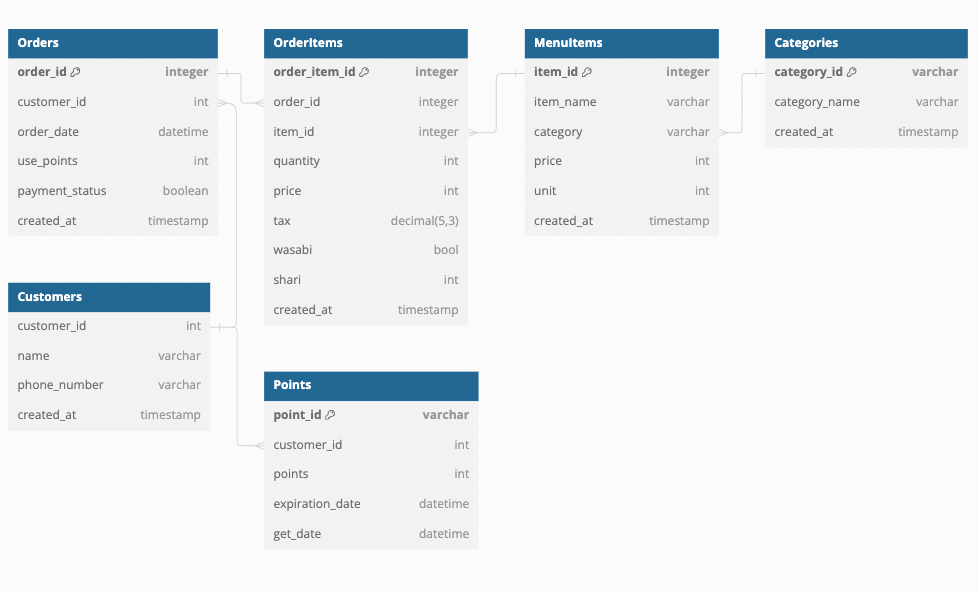

# 寿司注文管理システムのテーブル設計

## ER図


## DDL
テーブル作成
[ddl.sql](./ddl.sql)

## DML
サンプルデータ挿入
[sample_dml.sql](./sample_dml.sql)

## ユースケースの例

今日のcustomer_id=1の顧客の注文一覧を表示する
```sql
SELECT MenuItems.item_name, DATE(Orders.order_date)
FROM Orders
JOIN OrderItems ON Orders.order_id = OrderItems.order_id 
JOIN MenuItems ON OrderItems.item_id = MenuItems.item_id 
WHERE Orders.customer_id = 1 AND DATE(Orders.order_date) = CURDATE();
```

| item_name | DATE |
|---------|---------|
| わだつみ| 2024-06-08| 
| 玉子| 2024-06-08| 


customer_id=1の顧客のポイントの増減履歴を得る
```sql
SELECT Customers.customer_name,
Points.points, Points.get_date
FROM Customers
JOIN Points ON Customers.customer_id = Points.customer_id
WHERE Customers.customer_id = 1;
```

| customer_name | Points | DATE | 
|---------|----------|---------|
| 田中太郎| 100 | 2024-06-08 14:00:00| 
| 田中太郎| -100 | 2024-06-08 14:00:00| 
| 田中太郎| 300 | 2024-06-15 14:00:00|

customer_id=1の顧客が，わだつみ１つとしおん１つを注文し，100ポイント利用して，200ポイント得た場合
```sql
-- Orderを追加
INSERT INTO Orders (customer_id, order_date, use_points, payment_status, created_at) VALUES
(1, '2024-06-15 15:00:00', 100, FALSE, CURRENT_TIMESTAMP);

-- 最新のOrderIDを取得
SET @latest_order_id = (SELECT Orders.order_id 
                        FROM Orders 
                        ORDER BY Orders.order_date DESC 
                        LIMIT 1);

-- 注文のitem_idとpriceを取得
SET @wadatsumi_item_id = (SELECT item_id FROM MenuItems
WHERE item_name = 'わだつみ');

SET @wadatsumi_price = (SELECT price FROM MenuItems WHERE item_name = 'わだつみ');

SET @shion_item_id = (SELECT item_id FROM MenuItems
WHERE item_name = 'しおん';);

SET @shion_price = (SELECT price FROM MenuItems WHERE item_name = 'しおん');

-- わだつみのOrderItemを追加
INSERT INTO OrderItems (order_id, item_id, quantity, price, tax, wasabi, sushi, created_at) VALUES
(@latest_order_id, @wadatsumi_item_id, 1, @wadatsumi_price, 0.1, TRUE, '大');

-- しおんのOrderItemを追加
INSERT INTO OrderItems (order_id, item_id, quantity, price, tax, wasabi, sushi, created_at) VALUES
(@latest_order_id, @shion_item_id, 1, @shion_price, 0.1, TRUE, '大');

-- Points使用
INSERT INTO Points (customer_id, points, expiration_date, get_date) VALUES
(1, -100, '9999-10-16 15:00:00', '2024-06-15 15:00:00');

-- Points獲得
INSERT INTO Points (customer_id, points, expiration_date, get_date) VALUES
(1, 200, '2024-10-16 15:00:00', '2024-06-15 15:00:00');
```


