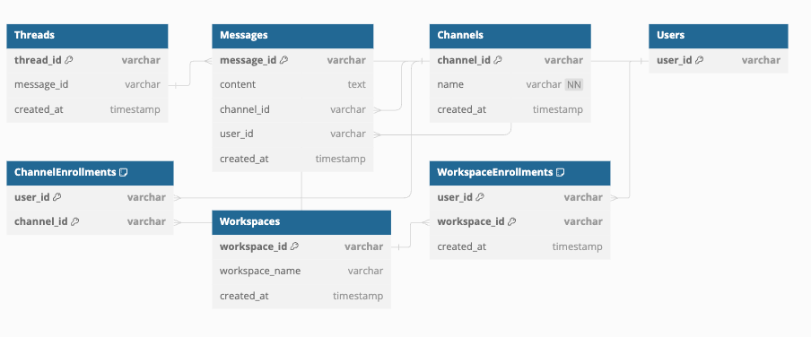

# SlackのようなチャットサービスのDB設計

## 仕様（課題文よりコピペ）
Slackに存在する全ての仕様を満たそうとすると難しすぎるので、以下の仕様を満たすだけで構いません。

- メッセージ
    - 誰が、どのチャネルに、いつ、どんな内容を投稿したのか分かること
- スレッドメッセージ
    - 誰が、どのメッセージに、いつ、どんな内容をスレッドとして投稿したのか分かること
- チャネル
    - そのチャネルに所属しているユーザにしか、メッセージ・スレッドメッセージが見えないこと
- ユーザ
    - ワークスペースに参加・脱退できること
    - チャネルに参加・脱退できること
- 横断機能
    - メッセージとスレッドメッセージを横断的に検索できること（例えば「hoge」と検索したら、この文字列を含むメッセージとスレッドメッセージを両方とも取得できること）
    - 参加していないチャネルのメッセージ・スレッドメッセージは検索できないこと

## ER図

[er.dbml](er.dbml)

## DDL
[ddl.sql](ddl.sql)

## DML
[dml.sql](dml.sql)

## ユースケース

### 自分が所属しているチャネルの中を横断的に検索する
```sql
SELECT m.message_id, m.content, m.channel_id, m.user_id, m.created_at
FROM Messages m
JOIN ChannelEnrollments ce ON m.channel_id = ce.channel_id
WHERE ce.user_id = 'user1'  -- ユーザーIDを指定
AND m.content LIKE '%あいうえお%'  -- 検索キーワードを指定
ORDER BY m.created_at DESC;
```

### チャネルに新しいメッセージを投稿する
ユーザーID、チャンネルID、メッセージ内容を変数として設定
例えば 'user1', 'channel1', 'こんにちは' を使用する場合
ユーザがチャネルに所属していることはアプリケーションで確認してから以下のSQLを発行する
```sql
-- 確認後、アプリケーションロジックで所属がTRUEの場合に以下の挿入クエリを実行
INSERT INTO Messages (message_id, content, channel_id, user_id, created_at)
VALUES (UUID(), 'こんにちは', 'channel1', 'user1', CURRENT_TIMESTAMP);
```
