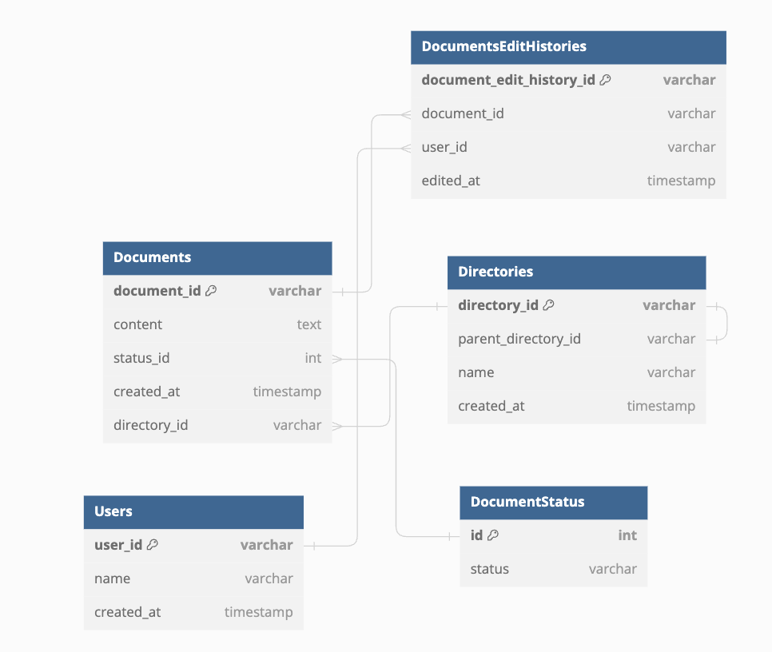

## 課題
[Confluence](https://www.atlassian.com/ja/software/confluence) や [esa](https://esa.io/) や [Kibela](https://kibe.la/) のようなドキュメント管理システムのデータベースを設計してスケッチを作成してください。

以下の機能を備えているものとします

- ドキュメント
    - いつ、誰が、どんなテキスト情報を保存したのか管理する
    - ドキュメントは必ず何らかのディレクトリに属する
- ディレクトリ
    - 一つ以上のドキュメントを含む階層構造
    - ディレクトリは無制限にサブディレクトリを持つことができる
    - ディレクトリ構造は柔軟に変更可能。ディレクトリが移動してサブディレクトリになることもあり得る
- ユーザ
    - ドキュメントをCRUD（作成、参照、更新、削除）できる
    - ディレクトリをCRUDできる

## ER図
- ドキュメントのCRUD操作: DocumentsテーブルとDocumentStatusを使用して管理。
- ディレクトリによる階層的な管理: Directoriesテーブルを使用して階層構造を表現。
- ドキュメントの編集履歴の追跡: DocumentsEditHistoriesを通じて実装。
- ドキュメントには，下書き，発行済み，アーカイブの３つの状態がある．



## DDL

## DML

## Usecase

### 新しいドキュメントを作成

dir002ディレクトリに新しいドキュメントを作成.ドキュメントの作成と編集履歴の保存はトランザクションを貼って実行する

```sql
BEGIN;

-- ドキュメントの挿入
INSERT INTO Documents (document_id, content, status_id, created_at, directory_id) VALUES
('doc003', '新しいドキュメントの内容です。', 1, CURRENT_TIMESTAMP, 'dir002');

-- 編集履歴の挿入
INSERT INTO DocumentsEditHistories (document_edit_history_id, document_id, user_id, edited_at) VALUES
('edit001', 'doc003', 'user001', CURRENT_TIMESTAMP);

COMMIT;
```

### ドキュメントに内容を追記

既存のドキュメントに内容を追記

```sql
BEGIN;

-- 既存のドキュメントの内容にテキストを追記
UPDATE Documents
SET
  content = CONCAT(content, ' 追加する新しい内容です。')
WHERE
  document_id = 'doc003';

-- 編集履歴を挿入
INSERT INTO DocumentsEditHistories (document_edit_history_id, document_id, user_id, edited_at) VALUES
('new_history_id', 'doc003', 'user001', CURRENT_TIMESTAMP);

COMMIT;
```

### ドキュメントを発行する

```sql
BEGIN;

-- ドキュメントのステータスを更新
UPDATE Documents
SET
  status_id = 2  -- 発行済みにする
WHERE
  document_id = 'doc003';

-- 編集履歴を挿入
INSERT INTO DocumentsEditHistories (document_edit_history_id, document_id, user_id, edited_at) VALUES
('new_history_id', 'doc003', 'user001', CURRENT_TIMESTAMP);

COMMIT;

```

### ディレクトリの階層構造の変更
dir001のサブディレクトリであるdir002をdir001と同じレベルのディレクトリに変える

```sql
UPDATE Directories
SET
  parent_directory_id = NULL
WHERE
  directory_id = 'dir002';

```

### ドキュメントを削除（アーカイブ）する

```sql
BEGIN;

-- ドキュメントのステータスをアーカイブに更新
UPDATE Documents
SET
  status_id = 3  -- アーカイブのステータスID
WHERE
  document_id = 'doc003';

-- 編集履歴を挿入
INSERT INTO DocumentsEditHistories (document_edit_history_id, document_id, user_id, edited_at) VALUES
('new_history_id', 'doc003', 'user001', CURRENT_TIMESTAMP);

COMMIT;
```

## ドキュメントに順番をつける場合

Documentテーブルにorder_indexカラムを追加する
```sql
ALTER TABLE Documents
ADD COLUMN order_index DOUBLE;
```

order_indexカラムでディレクトリ内の順番を保持する  
次のようなルールでorder_indexを計算する  
1. 先頭に移動するとき，移動が起こる前に先頭にいたorder_indexの半分の値にする
1. 二つのドキュメントの間に移動する時，それらのドキュメントの平均値を用いる
1. 最後尾に移動するとき，元々持っていたorder_indexに大きな数（65536など）を足す

参考：[TrelloのAPIリクエストを眺めてみた](https://zenn.dev/ktom106/articles/07aa8b0e43e93b)